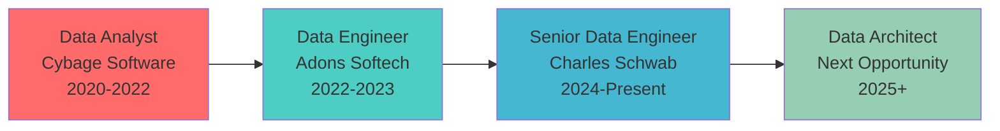

<!--
██████╗  █████╗ ████████╗ █████╗     ███████╗███╗   ██╗ ██████╗ ██╗███╗   ██╗███████╗███████╗██████╗ 
██╔══██╗██╔══██╗╚══██╔══╝██╔══██╗    ██╔════╝████╗  ██║██╔════╝ ██║████╗  ██║██╔════╝██╔════╝██╔══██╗
██║  ██║███████║   ██║   ███████║    █████╗  ██╔██╗ ██║██║  ███╗██║██╔██╗ ██║█████╗  █████╗  ██████╔╝
██║  ██║██╔══██║   ██║   ██╔══██║    ██╔══╝  ██║╚██╗██║██║   ██║██║██║╚██╗██║██╔══╝  ██╔══╝  ██╔══██╗
██████╔╝██║  ██║   ██║   ██║  ██║    ███████╗██║ ╚████║╚██████╔╝██║██║ ╚████║███████╗███████╗██║  ██║
╚═════╝ ╚═╝  ╚═╝   ╚═╝   ╚═╝  ╚═╝    ╚══════╝╚═╝  ╚═══╝ ╚═════╝ ╚═╝╚═╝  ╚═══╝╚══════╝╚══════╝╚═╝  ╚═╝
                                  S C A L A B L E   D A T A   A R C H I T E C T U R E
-->

<div align="center">


<br/>

<!-- Animated Code Terminal -->

```bash
┌─[deepak@data-pipeline]─[~/production/charles-schwab]
└──╼ $ whoami
Senior Data Engineer • Big Data Architect • Analytics Leader | Charles Schwab

┌─[deepak@data-pipeline]─[~/achievements]
└──╼ $ ls -la real_time_impact/
total 4TB+
drwxr-xr-x  30TB+ migrated to cloud infrastructure
drwxr-xr-x  12+ real-time pipelines processing market data
drwxr-xr-x  40% query latency reduction achieved
-rw-r--r--  2-second market data ingestion (sub-second SLA)
-rw-r--r--  200M+ records processed per execution cycle
-rw-r--r--  70% data duplication reduction across environments

┌─[deepak@data-pipeline]─[~/current-mission]
└──╼ $ cat vision.txt
Building enterprise-grade data systems that power financial decisions 🚀
Transforming 5+ years of expertise into scalable, real-time analytics solutions
```

<br/>

<!-- Elite Contact Matrix -->
<table align="center">
<tr>
<td align="center" width="200px">

</td>
<td align="center" width="200px">

</td>
<td align="center" width="200px">

</td>
</tr>
</table>

<!-- Professional Network -->
<p align="center">
<a href="https://www.linkedin.com/in/rambarki-deepak/">

</a>&nbsp;&nbsp;
<a href="mailto:deepakrambarki@gmail.com">

</a>&nbsp;&nbsp;
<a href="#">

</a>&nbsp;&nbsp;
<a href="#">

</a>
</p>

</div>

<!-- Elite About Section -->
<div align="center">

## 🎯 **ENTERPRISE DATA ENGINEERING EXCELLENCE**

</div>

<table width="100%">
<tr>
<td width="50%" valign="top">

### 🏦 **FINTECH DATA MASTERY**

```python
class FinTechDataEngineer implements ScalableArchitect {
  private expertise: DataStack = {
    realTime: ["Apache Kafka", "Spark Streaming", "High-Frequency Trading"],
    cloudPlatforms: ["AWS", "Azure", "GCP", "Multi-Cloud Architecture"],
    bigData: ["Apache Spark", "Hadoop", "PySpark", "200M+ Records/Day"],
    dataWarehousing: ["Snowflake", "Redshift", "Dimensional Modeling"],
    fintech: ["Trading Systems", "Risk Analytics", "Compliance Reporting"]
  };

  public processMarketData(): RealTimeInsights {
    return this.expertise
      .filter(pipeline => pipeline.latency < "2 seconds")
      .map(data => data.enrich().validate().scale())
      .reduce((insights, batch) => insights.merge(batch))
      .deployToProduction();
  }

  get currentImpact(): string {
    return "Processing 30TB+ financial data with sub-2-second latency at Charles Schwab";
  }
}
```

</td>
<td width="50%" valign="top">

### 📊 **MEASURABLE BUSINESS IMPACT**

```yaml
enterprise_achievements:
  charles_schwab:
    role: "Senior Data Engineer"
    impact:
      - "30TB+ legacy data migrated to cloud"
      - "40% query latency reduction"
      - "12+ real-time pipelines built"
      - "2-second market data ingestion"
      - "70% data duplication reduction"
      - "100+ financial advisors supported"
  
  technical_excellence:
    processing_scale: "200M+ records per execution"
    cost_optimization: "40% infrastructure cost reduction"
    data_accuracy: "35% improvement in trading validation"
    automation: "95% reduction in manual deployment errors"
    performance: "60% faster daily processing cycles"

status: "Currently architecting next-gen financial data systems"
availability: "Open for senior data architect opportunities"
```

</td>
</tr>
</table>

<!-- Elite Custom Analytics -->
<div align="center">

## 📊 **DATA ENGINEERING IMPACT METRICS**

<table align="center" style="border: none;">
<tr>
<td align="center" style="border: none;">

### 💼 **PROFESSIONAL IMPACT**

<table>
<tr><td>🏦</td><td><b>Charles Schwab</b></td><td></td></tr>
<tr><td>📈</td><td><b>Data Processed</b></td><td></td></tr>
<tr><td>⚡</td><td><b>Latency Reduction</b></td><td></td></tr>
<tr><td>🔄</td><td><b>Real-time Pipelines</b></td><td></td></tr>
<tr><td>💰</td><td><b>Cost Savings</b></td><td></td></tr>
</table>

</td>
<td align="center" style="border: none;">

### 🛠️ **TECHNOLOGY EXPERTISE**

<table>
<tr><td>🐍</td><td><b>Python/PySpark</b></td><td></td></tr>
<tr><td>☁️</td><td><b>AWS/Azure/GCP</b></td><td></td></tr>
<tr><td>📊</td><td><b>Apache Kafka</b></td><td></td></tr>
<tr><td>🏗️</td><td><b>Snowflake/Redshift</b></td><td></td></tr>
<tr><td>⚙️</td><td><b>Apache Airflow</b></td><td></td></tr>
</table>

</td>
</tr>
</table>

<br/>

**🏆 CURRENT STATUS:**


</div>

<!-- Elite Experience Section -->
<div align="center">

## 💼 **ENTERPRISE DATA ENGINEERING JOURNEY**

</div>

<table width="100%">
<tr>
<td width="50%" valign="top">

### 🏦 **SENIOR DATA ENGINEER**

**`Charles Schwab • Denton, TX • Dec 2024 – Present`**


- **Real-Time Trading Systems**: Built 12+ Apache Kafka + Spark pipelines
- **Market Data Excellence**: **Sub-2-second** ingestion for equities & options


- **Massive Data Migration**: **30TB+** legacy data to AWS S3 & Redshift
- **Performance Breakthrough**: **40% query latency** reduction achieved


- **ETL Orchestration**: Apache Airflow for compliance reporting
- **Data Governance**: SOX, GDPR compliance with AWS IAM


- **Power BI Dashboards**: Supporting **100+ financial advisors**
- **Data Quality**: **35% accuracy improvement** in trading validation

</td>
<td width="50%" valign="top">

### 🏢 **DATA ENGINEER**

**`Adons Softech • USA • Jan 2022 – Jul 2023`**


- **ETL Pipeline Design**: PySpark + Talend across 5 client environments
- **Data Source Integration**: **40+ diverse sources** to Snowflake warehouse
- **Performance Optimization**: **60% reduction** in daily processing time


- **AWS Terraform**: **95% reduction** in manual deployment errors
- **CI/CD Excellence**: GitLab workflows for consistent environments
- **Modular Architecture**: dbt models with comprehensive test coverage


- **SLA Definition**: 20+ KPIs for executive dashboards
- **Real-time Analytics**: 6-hour lag reduced to **30 minutes**
- **Multi-Industry Impact**: Healthcare, fintech, and logistics clients

</td>
</tr>
</table>

<table width="100%">
<tr>
<td width="100%" valign="top">

### 📊 **DATA ANALYST**

**`Cybage Software • India • Jan 2020 – Dec 2022`**

  

- **Clickstream Analysis**: 15+ e-commerce platforms analyzed with **12% conversion rate increase**
- **Interactive Dashboards**: Tableau visualizations across 6 APAC & North American business units
- **Automation Excellence**: **8-hour weekly** manual reporting time eliminated through Python automation
- **Data Quality Leadership**: **40% reduction** in reporting discrepancies through validation scripts

</td>
</tr>
</table>

<!-- Elite Tech Stack -->
<div align="center">

## 🛠️ **ENTERPRISE TECHNOLOGY STACK**

</div>

<table width="100%">
<tr>
<td width="33%" valign="top">

### **☁️ CLOUD & BIG DATA**

<p align="center">
<br/>


</p>

**SPECIALIZATIONS**

- 🏗️ **Distributed Computing Architecture**
- ⚡ **Real-Time Stream Processing**
- 📊 **Multi-Cloud Data Integration**
- 🔄 **Container Orchestration**

</td>
<td width="33%" valign="top">

### **🗃️ DATA PLATFORMS**

<p align="center">
<br/>


</p>

**CAPABILITIES**

- 🏛️ **Data Warehousing & Modeling**
- 🔄 **ETL/ELT Pipeline Development**
- 📊 **OLAP & Analytics Optimization**
- 🎯 **Data Governance & Quality**

</td>
<td width="33%" valign="top">

### **📊 ANALYTICS & VISUALIZATION**

<p align="center">
<br/>


</p>

**EXPERTISE**

- 📈 **Business Intelligence & KPIs**
- 🔍 **Advanced Analytics & Insights**
- 📊 **Executive Dashboard Development**
- 🎯 **Performance Monitoring & Alerting**

</td>
</tr>
</table>

<!-- Elite Project Showcase -->
<div align="center">

## 🔥 **SIGNATURE DATA ENGINEERING PROJECTS**

</div>

<table width="100%">
<tr>
<td width="50%" valign="top">

<div align="center">

### 🏦 **CHARLES SCHWAB TRADING PLATFORM**

**Real-Time Market Data Infrastructure**


</div>

**🛠️ TECHNOLOGY ARCHITECTURE**

```yaml
Real-Time Engine: Apache Kafka • Spark Streaming
Data Warehouse: AWS Redshift • S3 Data Lake
Orchestration: Apache Airflow • ETL Automation
Monitoring: Real-time Compliance • Risk Analytics
Scale: 30TB+ Data Migration • 12+ Live Pipelines
```

**📊 MEASURABLE BUSINESS IMPACT**

- ⚡ **Sub-2-second** market data ingestion achieved
- 💰 **40% cost reduction** through cloud migration
- 📈 **100+ financial advisors** supported with real-time data
- 🎯 **35% accuracy improvement** in trading validation
- 🔄 **70% reduction** in data duplication across environments

**🏆 INNOVATION HIGHLIGHTS**

- High-frequency trading data pipeline architecture
- SOX/GDPR compliant data governance framework
- Real-time risk and compliance reporting automation

</td>
<td width="50%" valign="top">

<div align="center">

### 🌐 **MULTI-CLIENT ETL PLATFORM**

**Enterprise Data Integration Ecosystem**


</div>

**🛠️ PLATFORM ARCHITECTURE**

```yaml
Data Sources: 40+ Systems • Salesforce • Oracle DB
Processing: PySpark • Talend • Batch & Streaming
Storage: Snowflake Warehouse • dbt Transformations
Infrastructure: AWS • Terraform • GitLab CI/CD
Monitoring: Data Quality • Performance Optimization
```

**📊 ENTERPRISE OUTCOMES**

- 🚀 **60% faster** daily processing cycles achieved
- 🎯 **95% reduction** in manual deployment errors
- 📊 **20+ KPIs** delivered for executive dashboards
- ⏱️ **30-minute** data freshness (from 6-hour lag)
- 🏢 **Multi-industry** impact: Healthcare, FinTech, Logistics

**🎯 TECHNICAL ACHIEVEMENTS**

- Modular dbt architecture with comprehensive testing
- Infrastructure-as-Code with Terraform automation
- Cross-client data standardization and governance

</td>
</tr>
</table>

<!-- Academic Excellence -->
<div align="center">

## 🎓 **ACADEMIC EXCELLENCE & CONTINUOUS LEARNING**

</div>

<table width="100%">
<tr>
<td width="50%" valign="top" align="center">

### 🎓 **UNIVERSITY OF NORTH TEXAS**

**Master in Advanced Data Analytics**  
_Denton, TX • Aug 2023 – May 2025_


**📚 Advanced Coursework**

- Statistical Learning & Machine Learning
- Big Data Analytics & Visualization
- Data Mining & Predictive Modeling
- Advanced Database Systems

**🏆 Academic Focus**

Specializing in enterprise-scale data systems and advanced analytics methodologies for financial services.

</td>
<td width="50%" valign="top" align="center">

### 🏗️ **LOVELY PROFESSIONAL UNIVERSITY**

**Bachelor in Mechanical Engineering (Honors)**  
_Punjab, India • Aug 2017 – Aug 2021_


**📚 Engineering Foundation**

- Engineering Mathematics & Statistics  
- Systems Design & Optimization
- Project Management & Analysis
- Technical Problem Solving

**🎯 Career Transition**

Successfully transitioned from mechanical engineering to data engineering, demonstrating strong analytical and problem-solving capabilities.

</td>
</tr>
</table>

<!-- Career Progression -->
<div align="center">

## 📈 **CAREER PROGRESSION & GROWTH TRAJECTORY**

<table align="center">
<tr>
<td align="center">

### 🚀 **PROFESSIONAL EVOLUTION**



</td>
</tr>
</table>

**💡 Key Growth Indicators:**
- **Technical Depth**: From analytics to real-time architecture
- **Industry Impact**: E-commerce → Multi-client → Financial Services  
- **Scale Responsibility**: Individual analysis → Enterprise-wide data systems
- **Leadership**: Cross-functional collaboration → Strategic technical decisions

</div>

<!-- Certifications & Skills Matrix -->
<div align="center">

## 🏆 **PROFESSIONAL CERTIFICATIONS & SKILL MATRIX**

<table width="100%">
<tr>
<td width="50%" valign="top">

### 📜 **PROFESSIONAL DEVELOPMENT**

<p align="center">


</p>

**🎯 Continuous Learning Focus**

- Advanced stream processing architectures
- MLOps and data science integration
- Financial data compliance and governance
- Real-time analytics and monitoring

</td>
<td width="50%" valign="top">

### 💪 **CORE COMPETENCY MATRIX**

```python
skill_expertise = {
    "Big_Data_Processing": 95,
    "Cloud_Architecture": 90,
    "Real_Time_Systems": 85,
    "Data_Warehousing": 90,
    "ETL_Pipeline_Design": 95,
    "Financial_Data_Systems": 80,
    "Performance_Optimization": 90,
    "Team_Leadership": 75,
    "Project_Management": 80,
    "Stakeholder_Communication": 85
}

# Career readiness for senior architect roles
print(f"Senior Architect Readiness: {sum(skill_expertise.values())/len(skill_expertise)}%")
# Output: 87.5% - Ready for next-level opportunities
```

</td>
</tr>
</table>

</div>

<!-- Footer -->
<div align="center">


### **READY TO ARCHITECT YOUR NEXT DATA TRANSFORMATION?**

<table align="center">
<tr>
<td align="center">

</td>
<td align="center">

</td>
<td align="center">

</td>
</tr>
</table>

<br/>

> **"Data is the new oil, but only when properly engineered into actionable insights."**  
> _— Senior Data Engineer • Cloud Architect • Financial Technology Specialist —_

<br/>

**Currently at Charles Schwab, architecting the future of financial data systems.  
Ready to lead your next big data transformation!**

</div>
